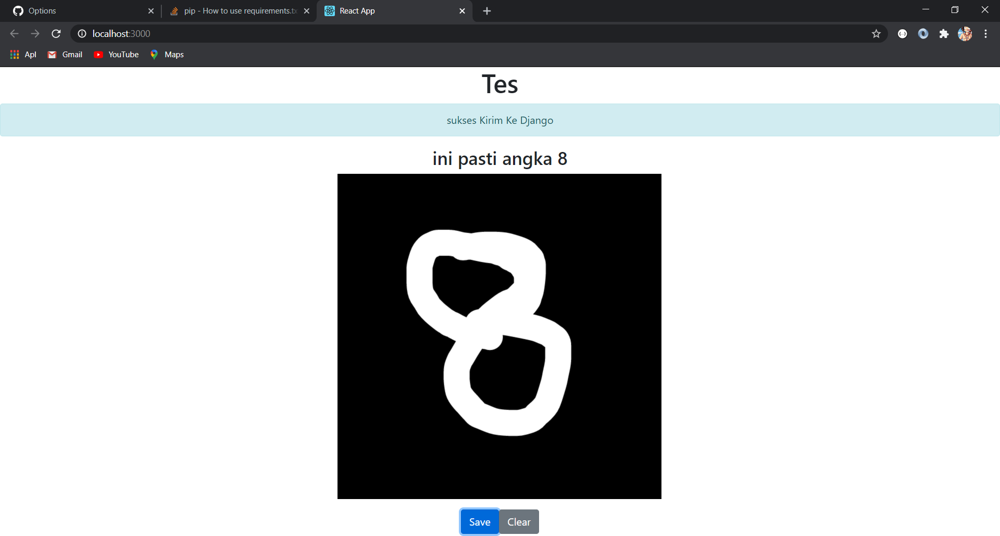

# Install Untuk Node Js / React
install Node Js
-npm create-react-app yourappname \
-npm install react-bootstrap bootstrap \
-npm install react-sketch --save \
-npm i file-saver\
-npm i axios\
~npm start

# Install Untuk Django
Install Python 3.xx \
pip install -r requirements.txt \
~ python manage.py runserver

# Hasil Contoh Progam

